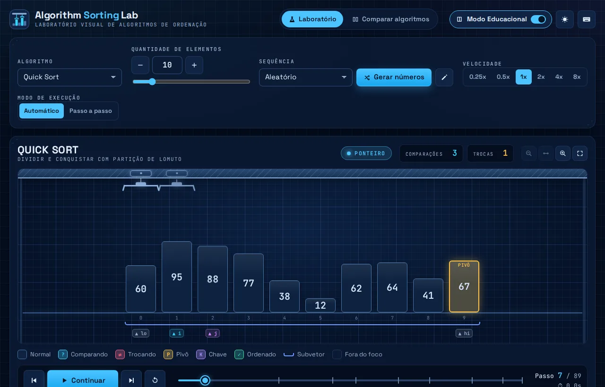
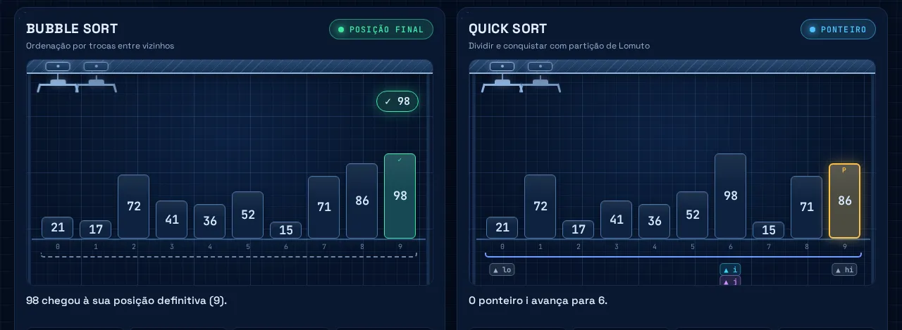
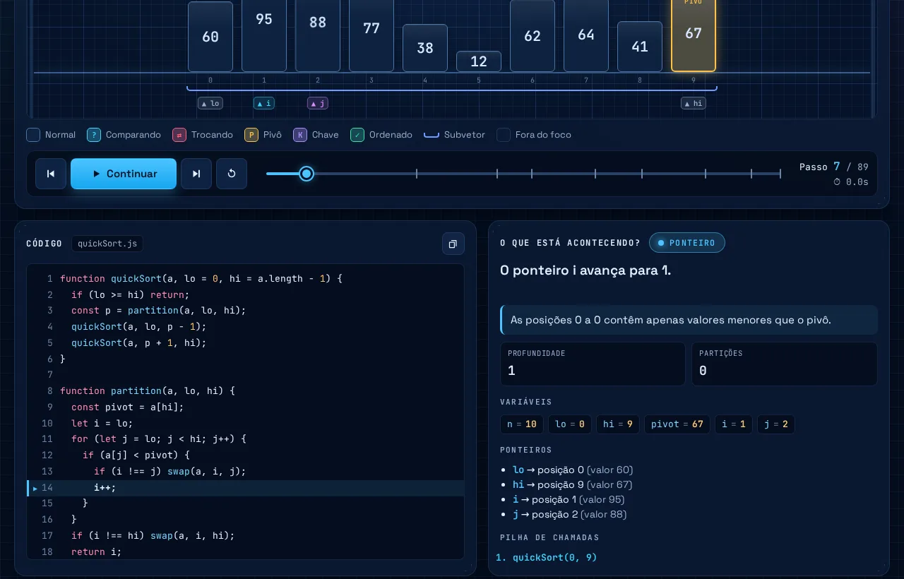

# Algorithm Sorting Lab

**Laboratório visual e interativo para aprender algoritmos de ordenação passo a passo.**

Em vez de barras que apenas sobem e descem, o Algorithm Sorting Lab mostra os números como caixas que são
**fisicamente manipuladas** por um pórtico com duas garras: elas descem até os elementos comparados, levantam as
caixas, cruzam no ar durante as trocas e as recolocam no lugar — sincronizadas com o código, as variáveis e uma
explicação em linguagem simples de cada operação.



---

## Sumário

- [Funcionalidades](#funcionalidades)
- [Algoritmos](#algoritmos)
- [Como executar](#como-executar)
- [Como gerar a versão de produção](#como-gerar-a-versão-de-produção)
- [Testes](#testes)
- [Atalhos de teclado](#atalhos-de-teclado)
- [Arquitetura](#arquitetura)
- [Como adicionar um novo algoritmo](#como-adicionar-um-novo-algoritmo)
- [Objetivo educacional](#objetivo-educacional)
- [Licença](#licença)

## Funcionalidades

**Animação física**

- Pórtico com duas talhas (garra **A** na frente, garra **B** atrás) que se movem até os elementos analisados.
- Comparações com destaque dos dois elementos e um mostrador com a relação real (`7 > 3`).
- Trocas animadas de verdade: as caixas são levantadas, se cruzam (uma pela frente, outra por trás) e pousam na
  nova posição.
- Insertion Sort com a **chave segurada pela garra** enquanto os maiores se deslocam; Merge Sort com uma
  **bancada auxiliar** para onde as caixas descem e de onde voltam intercaladas.
- Estados visuais que não dependem só de cor: rótulos `?` (comparando), `⇄` (trocando), `P`/`PIVÔ`, `K`/`CHAVE`,
  `✓` (ordenado), além de ponteiros nomeados (`i`, `j`, `min`, `lo`, `hi`, `k`, `root`…) e colchetes de subvetor.

**Dados**

- Quantidade de elementos configurável de **3 a 50** (padrão 8), com botões `−`/`+`, campo numérico e controle
  deslizante — a sequência é gerada automaticamente a cada mudança.
- Sequências prontas: aleatória, quase ordenada, inversa, já ordenada e com muitos repetidos.
- Inserção manual (`12, 4, 28, 7…`) com validação: campos vazios, textos, decimais, valores fora de −999…999 e
  quantidades fora de 3…50 são recusados com mensagens claras. Números negativos e repetidos são aceitos.
- Layout adaptativo: caixas grandes com poucos elementos; estreitas, com rótulos verticais e rolagem horizontal
  com acompanhamento automático da garra quando há muitos. Zoom manual (`+`/`−`/ajustar).

**Execução**

- Iniciar, pausar, continuar, **próximo passo**, **passo anterior** e reiniciar.
- Modo **automático** e modo **passo a passo** (só avança quando você clicar).
- Velocidades 0,25x a 8x, alteráveis durante a execução — a velocidade nunca altera o resultado.
- **Linha do tempo** navegável (com marcos de passadas, partições e mesclas) e **histórico** clicável.
- Tela cheia / modo apresentação da área de animação.

**Estudo**

- Painel **Código** com a linha atual destacada e a condição avaliada ao lado (`43 < 91 verdadeiro`).
- Painel **O que está acontecendo?** com a explicação de cada passo, o motivo de cada comparação e troca,
  variáveis, ponteiros e pilha de chamadas.
- **Métricas reais**: comparações, trocas, escritas, passos, tempo de animação e métricas específicas (passadas,
  recursões, partições, profundidade máxima, mesclas, deslocamentos, ajustes do heap). Exportáveis em JSON e CSV.
- **Árvore de recursão** (Quick Sort e Merge Sort) e **árvore do heap** (Heap Sort).
- Ficha de cada algoritmo: descrição, etapas, complexidades (melhor/médio/pior/memória), estabilidade e uma
  explicação simples da notação O.
- **Modo Educacional**: ligado, mostra tudo acima; desligado, mostra apenas a animação e as métricas principais.

**Comparar algoritmos**

- Dois algoritmos lado a lado com **exatamente a mesma sequência**, avançando no mesmo ritmo.
- Ao final, um resumo objetivo das métricas (sem declarar um "vencedor" pelo tempo do navegador) e uma tabela
  com todos os algoritmos para a mesma entrada.



**Interface**

- Tema escuro ("blueprint") e tema claro, lembrados entre visitas.
- Responsivo: no celular os painéis são reorganizados verticalmente e os controles de reprodução ficam fixos na
  parte de baixo da tela.
- Acessível: navegação por teclado, foco visível, `aria-label`s, região *live* que anuncia cada passo quando a
  execução está pausada, contraste adequado e respeito a `prefers-reduced-motion`.



## Algoritmos

| Algoritmo      | Melhor     | Médio      | Pior       | Memória  | Estável | Destaques na visualização                         |
| -------------- | ---------- | ---------- | ---------- | -------- | ------- | ------------------------------------------------- |
| Bubble Sort    | O(n)       | O(n²)      | O(n²)      | O(1)     | Sim     | Passadas, vizinhos comparados, parada antecipada  |
| Quick Sort     | O(n log n) | O(n log n) | O(n²)      | O(log n) | Não     | Pivô, ponteiros `i`/`j`, partição, recursão       |
| Selection Sort | O(n²)      | O(n²)      | O(n²)      | O(1)     | Não     | Ponteiro `min`, uma troca por passada             |
| Insertion Sort | O(n)       | O(n²)      | O(n²)      | O(1)     | Sim     | Chave segurada pela garra, deslocamentos          |
| Merge Sort     | O(n log n) | O(n log n) | O(n log n) | O(n)     | Sim     | Divisões, vetor auxiliar, intercalação, recursão  |
| Heap Sort      | O(n log n) | O(n log n) | O(n log n) | O(1)     | Não     | Árvore do heap, `siftDown`, extração da raiz      |

O Quick Sort usa a partição de Lomuto (pivô = último elemento do subvetor). Cada algoritmo executa a sua lógica
verdadeira — nenhuma animação é genérica.

## Como executar

Requisitos: [Node.js](https://nodejs.org/) 20.19+ ou 22.12+.

```bash
npm install
npm run dev
```

Abra o endereço exibido no terminal (normalmente <http://localhost:5173>).

> O arquivo `.npmrc` do projeto ativa `legacy-peer-deps` para contornar um erro conhecido do npm 10 ao resolver
> dependências opcionais do Vitest. Nenhuma configuração extra é necessária.

## Como gerar a versão de produção

```bash
npm run build     # verifica os tipos e gera a pasta dist/
npm run preview   # serve a versão de produção localmente
```

O resultado em `dist/` é um site estático que funciona inteiramente no navegador (sem backend) e usa caminhos
relativos, podendo ser publicado em qualquer hospedagem estática (GitHub Pages, Netlify, Vercel…).

## Testes

```bash
npm test
```

Os testes (Vitest) verificam, para os seis algoritmos:

- o exemplo `[8, 3, 5, 1] → [1, 3, 5, 8]`, números repetidos, vetor já ordenado, vetor inverso, conjuntos
  pequenos, um elemento, vetor vazio, negativos e valores duplicados;
- 300 vetores aleatórios de todos os tipos, e que todos os algoritmos produzem exatamente a mesma saída;
- que **as métricas exibidas são idênticas às de implementações de referência sem instrumentação**
  (comparações, trocas, recursões e deslocamentos);
- a consistência dos quadros: nenhum elemento é perdido ou duplicado em nenhum passo, o último quadro está
  ordenado e toda linha de código destacada existe;
- a validação da entrada manual e a geração das sequências.

## Atalhos de teclado

| Tecla        | Ação                                                   |
| ------------ | ------------------------------------------------------ |
| `Espaço`     | Iniciar / pausar (no modo passo a passo: próximo passo) |
| `→` / `←`    | Próximo passo / passo anterior                         |
| `Home`/`End` | Início / fim da execução                               |
| `R`          | Reiniciar                                              |
| `G`          | Gerar nova sequência                                   |
| `E`          | Ligar/desligar o Modo Educacional                      |
| `F`          | Tela cheia da animação                                 |
| `+` / `−`    | Ampliar / reduzir as caixas                            |
| `?`          | Ajuda com os atalhos                                   |

Os atalhos são ignorados enquanto você digita em um campo.

## Arquitetura

Tecnologias: **React 19 + TypeScript + Vite**, testes com **Vitest**. Animações com CSS e a Web Animations API
(sem canvas e sem bibliotecas de animação).

```
src/
├── algorithms/      # um arquivo por algoritmo (código exibido + execução instrumentada) e testes
├── engine/          # Tracer, tipos de eventos, construção dos quadros, tempos e rótulos de estado
├── visualization/   # Stage (pórtico, garras, caixas), geometria, planejador de movimentos, árvores
├── components/      # painéis e controles da interface
├── hooks/           # player (reprodução), atalhos, tema, preferências, medidas
├── utils/           # geração de sequências, validação da entrada, exportação, formatação
└── styles/          # tokens de tema, base, layout, área de animação e painéis
```

O fluxo é baseado em eventos, separando **algoritmo** e **visualização**:

1. **Algoritmo** — cada algoritmo roda de verdade sobre um `Tracer`, que guarda os valores e expõe as operações
   (`compare`, `swap`, `pivot`, `sorted`, `lift`/`shift`/`drop`, `copyToAux`, `call`…). Toda operação é aplicada
   e registrada como um evento, por exemplo:

   ```js
   { type: 'code-line', line: 6 }
   { type: 'compare', left: { area: 'main', index: 2 }, right: { area: 'main', index: 3 }, operator: '>', values: [7, 3], result: true }
   { type: 'swap', indices: [2, 3] }
   { type: 'pivot', index: 7 }
   { type: 'sorted', indices: [5] }
   ```

2. **Motor** — `buildFrames` reduz os eventos em **quadros** imutáveis: cada evento de ação (comparação, troca…)
   fecha um passo, e os eventos de contexto (linha de código, ponteiros, variáveis, explicação) pertencem a esse
   passo. As métricas são contadas a partir das operações reais.
3. **Reprodução** — `usePlayer` navega pelos quadros com um único temporizador (sem timers duplicados). Como toda
   a execução fica registrada, voltar um passo ou saltar na linha do tempo nunca corrompe o estado. Trocar de
   algoritmo, de quantidade ou de sequência cria uma nova execução e reinicia tudo.
4. **Visualização** — o `Stage` desenha o quadro atual; o planejador de movimentos (`motion.ts`) compara o quadro
   anterior com o atual e descreve os caminhos (arcos de troca, aproximação das garras, deslocamentos), executados
   com a Web Animations API. Animações interrompidas continuam da posição em que estavam.

## Como adicionar um novo algoritmo

1. Crie `src/algorithms/meuSort.ts` exportando um `AlgorithmDefinition`: nome, descrição, complexidades, o
   código exibido (marque linhas com `//@rotulo`) e a função `run(t)`, que executa o algoritmo usando o `Tracer`
   (`t.at('rotulo')` destaca a linha; `t.compare`, `t.swap`… executam e registram as operações).
2. Registre-o em `src/algorithms/index.ts`.
3. Pronto: seletor, animação, código, métricas, histórico, linha do tempo, comparação e os testes genéricos
   passam a incluí-lo automaticamente.

## Objetivo educacional

O projeto foi criado para ajudar estudantes a **enxergar** o que acontece dentro de um algoritmo de ordenação:
quais elementos estão sendo comparados e por quê, quando e por que acontece uma troca, como os ponteiros andam e
como a recursão divide o problema. Cada passo traz uma explicação em linguagem simples, pensada para quem nunca
estudou algoritmos, e as métricas reais permitem relacionar a teoria (O(n²), O(n log n)) com o trabalho de
verdade feito em cada sequência.

## Licença

Distribuído sob a licença [MIT](LICENSE).
